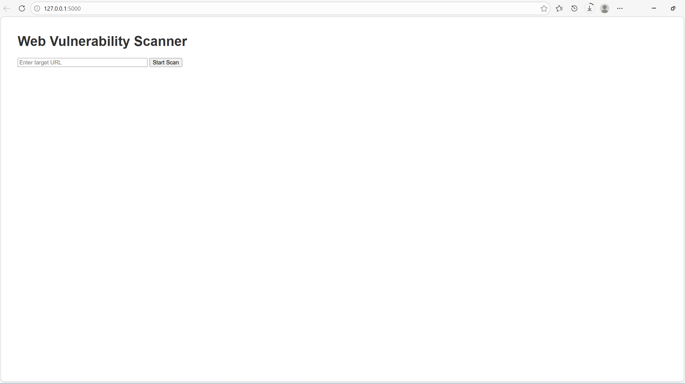
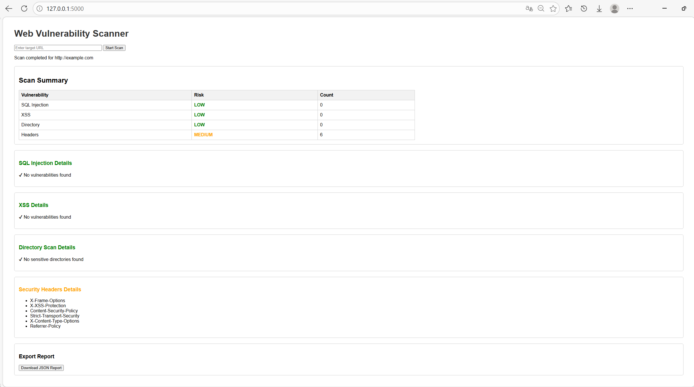
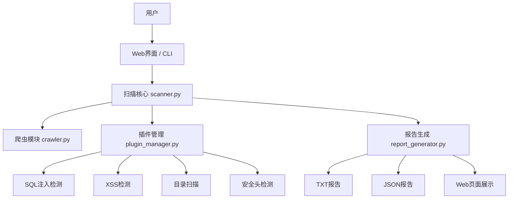
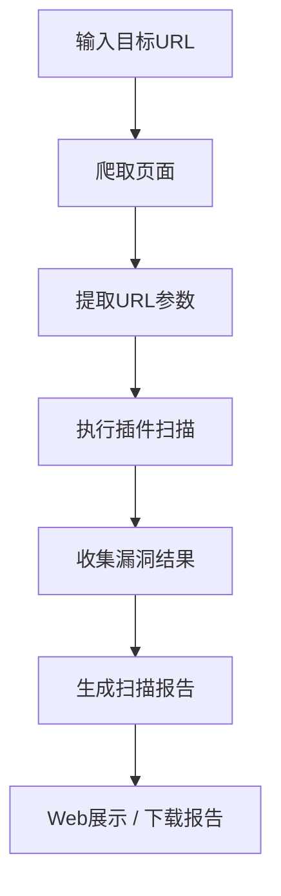

# 🔍 Mini Web Vulnerability Scanner


轻量级 Web 漏洞扫描与可视化分析工具

---

## 一、项目简介

Mini Web Vulnerability Scanner 是一个基于 Python 实现的轻量级 Web 安全扫描工具，用于对目标网站进行自动化漏洞检测与安全分析。

系统通过爬虫技术获取目标页面，并结合插件化检测机制，对常见 Web 漏洞进行扫描与分析，同时生成结构化报告并提供 Web 可视化展示。

本项目适用于：

- Web 安全教学实验  
- 漏洞扫描原理学习  
- 安全工具开发实践  
- 网络安全课程设计  

---

## 二、项目演示

### Web 扫描界面


### 扫描结果展示


---

## 三、CLI 使用示例

执行扫描：

```bash
python main.py --url http://example.com
````

输出示例：

```text
[+] Found URLs
[+] Expanding parameters
[PluginManager] Running SQL Injection Scan
[PluginManager] Running XSS Scan
[PluginManager] Running Directory Scan
[PluginManager] Running Header Scan
```

生成报告：

```text
scan_report.txt
scan_report.json
```

---

## 四、快速开始

启动 Web 界面：

```bash
python webapp.py
```

浏览器访问：

```text
http://127.0.0.1:5000
```

---

## 五、项目架构



---

## 六、工作流程


---

## 七、主要功能

### 1 网站爬取

自动抓取目标站点 URL，并提取参数用于后续漏洞测试。

---

### 2 SQL 注入检测

对 URL 参数进行注入测试，检测潜在 SQL 注入漏洞。

---

### 3 XSS 漏洞检测

检测页面是否存在跨站脚本攻击（XSS）风险。

---

### 4 敏感目录扫描

扫描常见敏感路径：

* /admin
* /login
* /backup

---

### 5 HTTP 安全头检测

检测关键安全头：

* Content-Security-Policy
* X-Frame-Options
* X-XSS-Protection

---

### 6 报告生成

生成两种格式：

```text
scan_report.txt
scan_report.json
```

---

### 7 Web 可视化界面

提供 Web 页面：

* 输入目标 URL
* 启动扫描
* 实时展示结果
* 下载报告

---

## 八、项目结构

```text
miniwebscanner
│
├── core
│   ├── scanner.py
│   ├── crawler.py
│   └── plugin_manager.py
│
├── plugins
│   ├── base_plugin.py
│   ├── sql_injection.py
│   ├── xss_scanner.py
│   ├── dir_scanner.py
│   └── header_scanner.py
│
├── report
│   └── report_generator.py
│
├── templates
│   └── index.html
│
├── webapp.py
├── main.py
├── requirements.txt
└── README.md
```

---

## 九、安装方法

### 1 安装 Python

```bash
Python 3.10+
```

---

### 2 创建虚拟环境

```bash
python -m venv venv
```

激活环境：

```bash
venv\Scripts\activate
```

---

### 3 安装依赖

```bash
pip install -r requirements.txt
```

---

## 十、使用方法

### CLI 扫描

```bash
python main.py --url http://example.com
```

---

### Web 扫描

```bash
python webapp.py
```

访问：

```text
http://127.0.0.1:5000
```

---

## 十一、技术实现

本项目涉及以下关键技术：

* 爬虫技术（Requests + BeautifulSoup）
* 插件化架构（Plugin Pattern）
* Web 框架（Flask）
* 漏洞检测逻辑（SQL Injection / XSS）
* 报告生成（TXT / JSON）

---

## 十二、扩展方向

* 异步扫描（提高扫描效率）
* 实时结果刷新（AJAX / WebSocket）
* 增加更多漏洞检测插件（CSRF、SSRF 等）
* 扫描任务队列（Celery / Redis）
* 用户系统与权限管理
* 可视化图表分析

---

## 十三、贡献方式

欢迎参与本项目开发：

1. Fork 本仓库
2. 创建新分支
3. 提交 Pull Request

---

## 十四、许可证

本项目采用 MIT License 开源协议
